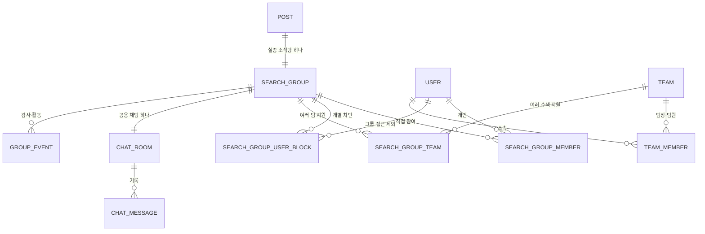

# Find-My-Pet 함께 찾기 설계

- 상태: 승인됨
- 승인일: 2026-07-25
- 대상 서비스: Find-My-Pet
- 영향 범위: `animal`, `find-my-pet-frontend`, `websocket-server`, Gateway 인증 연동
- 제품 사실 기준: `prd/find-my-pet/requirements.md`, `prd/find-my-pet/api-spec.md`

## 1. 목적

실종 소식 하나마다 수색그룹을 만들고, 개인과 팀이 같은 그룹에서 지도·알림·채팅을 이용하며 함께 반려동물을 찾을 수 있게 한다.

팀은 특정 사건이 끝나도 유지되는 조직이다. 한 팀이 여러 수색그룹을 지원할 수 있고, 한 수색그룹도 여러 팀의 지원을 받을 수 있다. 사용자는 팀에 가입하지 않아도 개인 자격으로 수색그룹에 직접 참여할 수 있다.

사용 흐름은 얕게 유지한다. 마이페이지 첫 화면에서 통합 지도, 함께 찾는 반려동물, 내 팀, 확인할 요청에 한 번에 진입하고, 주요 업무는 최대 두 번의 이동 안에 끝낸다.

## 2. 제품 언어

사용자 화면에는 기술적·행정적인 표현을 노출하지 않는다.

| 내부 개념 | 사용자 표현 |
|---|---|
| lost post / notice | 실종 소식 |
| post owner | 보호자 |
| search group | 수색그룹 |
| team owner | 팀장 |
| team member | 팀원 |
| managed cases | 함께 찾는 반려견 / 함께 찾는 반려묘 / 함께 찾는 반려동물 |
| pending actions | 확인할 요청 |
| close post | 수색 종료 |
| detach team | 우리 팀의 지원 종료 |

`admin`은 제품 역할과 사용자 화면에서 사용하지 않는다. 서비스 전체 관리자 권한과 팀 권한을 혼동하지 않게 한다.

## 3. 확정된 제품 결정

1. `SEARCHING` 실종 소식 하나에는 수색그룹이 정확히 하나 존재한다.
2. 팀과 수색그룹은 다대다 관계다.
3. 연결된 팀의 모든 활성 팀원은 해당 수색그룹의 지도·알림·채팅 권한을 자동으로 얻는다.
4. 개인도 팀 없이 수색그룹에 직접 참여할 수 있다.
5. 직접 참여 정책은 `자유롭게 참여`와 `승인 후 참여` 두 가지다.
6. 새 실종 소식의 기본 참여 정책은 `자유롭게 참여`다.
7. 카카오톡 공유는 그룹 초대가 아니라 공개 실종 소식 링크를 공유한다.
8. 팀 지원은 보호자와 팀장 어느 쪽에서도 요청할 수 있고, 상대가 수락해야 활성화된다.
9. 수색그룹 채팅방은 그룹마다 하나만 둔다. 팀 전용 채팅과 팀별 하위 채팅방은 만들지 않는다.
10. 지도에는 실종 지점과 시간 정보가 있는 목격 제보 위치를 서로 다른 마커로 표시한다.
11. 목격 제보 위치를 반려동물의 현재 위치로 표현하지 않는다.
12. 보호자의 `수색 종료`는 즉시 전체 수색을 종료한다. 실종 소식은 활성 목록과 지도에서 내려가고 그룹·채팅은 읽기 전용으로 보관한다.
13. 팀장은 전체 수색을 종료할 수 없다. 자기 팀의 지원 연결만 종료할 수 있다.
14. 개인 참여자는 자기 참여만 종료할 수 있다.

## 4. 범위와 단계

전체 기능은 한 번에 배포하지 않고 다음 순서로 구현한다. 각 단계는 자체 테스트와 완료 게이트를 통과해야 다음 단계로 진행한다.

### 4.1 1단계: 그룹·팀·승인·마이페이지

- 실종 소식 등록과 수색그룹 자동 생성
- 직접 참여와 가입 정책
- 팀 생성, 팀장·팀원 관리
- 팀과 수색그룹의 양방향 지원 요청·수락·거절·종료
- 마이페이지 통합 수색 허브
- 참여·승인·팀 지원 관련 서비스 내 알림
- 카카오톡 공개 실종 소식 공유 재사용

### 4.2 2단계: 통합 지도·목격 레이어·알림

- 개인 통합 지도
- 팀 통합 지도
- 수색그룹 단일 지도
- 실종 지점과 목격 제보 레이어
- 지도 필터, 마커 묶음, 모바일 하단 카드
- 수색 종료와 권한 회수를 지도에 즉시 반영

### 4.3 3단계: 기록형 그룹 채팅과 실시간 전송

- 수색그룹당 채팅방 하나
- 영구 저장되는 텍스트 메시지 기록
- 커서 기반 이전 메시지 조회
- 실시간 메시지 수신과 재연결
- 미읽음 수, 호명, 중요 시스템 이벤트 알림
- 수색 종료 시 읽기 전용 전환

## 5. 시스템 책임

### 5.1 `animal`

다음 데이터와 비즈니스 규칙의 단일 진실 공급원이다.

- 수색그룹과 직접 멤버십
- 팀과 팀 멤버십
- 팀-수색그룹 지원 관계
- 참여 정책과 승인 상태 전이
- 수색 종료 생명주기
- 지도 조회 권한과 지도용 읽기 모델
- 채팅방, 메시지 기록, 읽음 커서
- 구조화된 알림 이벤트
- 감사 기록

사용자 ID, 보호자 ID, 행위자 ID는 클라이언트 요청 본문에서 받지 않고 Gateway가 검증해 전달한 Passport에서만 얻는다.

### 5.2 `find-my-pet-frontend`

- 실종 소식 등록 시 참여 정책 선택
- 공개 상세의 `함께 찾기` 카드
- 마이페이지 통합 수색 허브
- 개인·팀·그룹 지도
- 승인 요청 처리
- 그룹 활동·채팅·멤버 화면
- 기존 카카오톡 공유 컴포넌트 재사용

인증은 기존 `withCredentials` API 클라이언트와 `/user/me`를 따른다. 토큰을 LocalStorage에 추가하거나 브라우저 코드가 Authorization 헤더를 직접 조립하지 않는다.

공유 링크에서 로그인으로 이동한 경우 안전한 same-origin 복귀 경로를 OAuth state에 보존해 로그인 뒤 원래 실종 소식으로 돌아온다.

### 5.3 `websocket-server`

실시간 이벤트 전달만 담당한다. 그룹·팀·멤버십의 진실 공급원이 되지 않는다.

- FMP 전용 채팅 네임스페이스와 방 구독
- 인증된 사용자에게 실시간 메시지·시스템 이벤트 방송
- 재연결 지원
- 권한 회수 이벤트를 받으면 기존 구독 해제

채팅 기록과 권한 판단은 `animal`이 담당한다. WebSocket 연결 성공만으로 그룹 접근을 허용하지 않는다.

### 5.4 Gateway

HttpOnly 쿠키 인증의 단일 진실 공급원이다. 클라이언트가 임의로 보낸 Passport 헤더를 제거하고 검증된 인증 컨텍스트만 내부 서비스로 전달한다.

## 6. 도메인 모델



### 6.1 SearchGroup

| 필드 | 의미 |
|---|---|
| `id` | UUID |
| `postId` | 실종 소식 ID, UNIQUE |
| `joinPolicy` | `OPEN` 또는 `APPROVAL_REQUIRED`, 기본 `OPEN` |
| `status` | `ACTIVE` 또는 `ARCHIVED` |
| `archivedReason` | `FOUND`, `POST_DELETED` 중 하나 |
| `archivedAt` | 수색 종료 시각 |

보호자는 별도 `ownerUserId`를 중복 저장하지 않고 `Post.authorId`에서 파생한다. 두 소유권 값이 어긋나는 문제를 만들지 않는다.

`SEEN` 목격 소식에는 수색그룹을 자동 생성하지 않는다. `SEARCHING` 실종 소식에만 생성한다.

### 6.2 SearchGroupMember

개인의 직접 참여만 저장한다. 팀을 통한 권한을 멤버 행으로 복사하지 않는다.

| 상태 | 의미 |
|---|---|
| `PENDING` | 승인 후 참여 대기 |
| `ACTIVE` | 직접 참여 중 |
| `REJECTED` | 보호자가 참여 요청을 거절함 |
| `LEFT` | 스스로 나감 |
| `REMOVED` | 보호자가 내보냄 |

`(groupId, userId)`는 유일하다. 재가입은 새 행 삽입이 아니라 기존 행의 명시적 상태 전이로 처리해 soft-delete와 UNIQUE 충돌을 피한다.

`LEFT`, `REJECTED`, `REMOVED` 사용자는 현재 참여 정책에 따라 다시 참여하거나 신청할 수 있다.

### 6.3 SearchGroupUserBlock

보호자가 특정 사용자의 그룹 접근을 차단하는 명시적인 deny list다. 직접 참여자뿐 아니라 팀을 통해 권한을 얻은 팀원에게도 적용한다.

| 필드 | 의미 |
|---|---|
| `groupId`, `userId` | 차단 대상, UNIQUE |
| `blockedBy` | 차단한 보호자 |
| `reason` | 운영 감사용 사유, 일반 참여자에게 공개하지 않음 |
| `blockedAt`, `unblockedAt` | 활성 차단 여부와 이력 |

보호자 자신은 차단 대상이 될 수 없다. 차단이 활성인 동안 직접 가입·팀 파생 권한·지도·알림·채팅 접근을 모두 거부한다.

### 6.4 Team과 TeamMember

팀 역할은 두 개뿐이다.

- `LEADER`: 팀 생성자 또는 이전받은 팀장
- `MEMBER`: 일반 팀원

팀 멤버십 상태는 `PENDING`, `ACTIVE`, `REJECTED`, `LEFT`, `REMOVED`를 사용한다. 팀원 가입은 참여 요청 후 팀장 승인 방식으로 시작한다. 팀장은 팀원을 내보낼 수 있다. 팀에는 정확히 한 명의 활성 `LEADER`가 있어야 하며, 팀장은 후임 팀장에게 권한을 이전하거나 팀을 보관 처리하기 전에는 팀을 나갈 수 없다.

### 6.5 SearchGroupTeam

팀과 수색그룹의 지원 연결을 저장한다.

| 상태 | 의미 |
|---|---|
| `PENDING_GROUP_APPROVAL` | 팀장이 지원을 제안했고 보호자 승인 대기 |
| `PENDING_TEAM_APPROVAL` | 보호자가 지원을 요청했고 팀장 승인 대기 |
| `ACTIVE` | 팀원 전체가 그룹에 접근 가능 |
| `DECLINED` | 상대가 거절함 |
| `WITHDRAWN` | 팀장이 자기 팀 지원을 종료함 |
| `REMOVED` | 보호자가 팀 지원을 종료함 |

`(groupId, teamId)`는 유일하다. 요청 시작자, 마지막 처리자, 요청·처리 시각을 기록한다.

### 6.6 Effective Membership

수색그룹의 실제 접근 권한은 다음 합집합이다.

```text
보호자
∪ ACTIVE 직접 SearchGroupMember
∪ ACTIVE SearchGroupTeam에 연결된 ACTIVE TeamMember
− 활성 SearchGroupUserBlock 대상
```

팀원을 각 수색그룹 멤버 테이블에 복사하지 않는다. 팀 탈퇴나 지원 종료 시 파생 권한이 즉시 사라지게 한다.

차단은 허용 권한보다 우선한다. 보호자는 특정 팀원 한 명을 그룹에서 차단하면서 나머지 팀의 지원은 유지할 수 있다.

## 7. 권한 규칙

| 행위 | 보호자 | 개인 참여자 | 팀장 | 팀원 |
|---|---:|---:|---:|---:|
| 실종 소식 수정·삭제 | O | X | X | X |
| 참여 정책 변경 | O | X | X | X |
| 직접 참여 요청 승인·거절 | O | X | X | X |
| 직접 참여자 내보내기 | O | X | X | X |
| 개인·팀 경로와 무관한 사용자 차단 | O | X | X | X |
| 팀에 지원 요청 | O | X | X | X |
| 팀의 지원 제안 수락·거절 | O | X | X | X |
| 보호자 요청 수락·거절 | X | X | O | X |
| 우리 팀의 지원 종료 | X | X | O | X |
| 개인 참여 종료 | 해당 없음 | O | 직접 참여 중이면 O | 직접 참여 중이면 O |
| 지도·알림·채팅 이용 | O | 활성일 때 O | 팀 지원 활성일 때 O | 팀 지원 활성일 때 O |
| 전체 수색 종료 | O | X | X | X |

보호자의 `수색 종료`는 최종 상태 전이다. v1은 종료된 수색그룹의 재활성화 API를 제공하지 않는다. 같은 반려동물이 새로운 사건으로 다시 실종되면 새 실종 소식과 새 수색그룹을 만든다.

## 8. 참여와 알림 흐름

### 8.1 자유롭게 참여

1. 로그인 사용자가 공개 실종 소식에서 `함께 찾기`를 누른다.
2. 서버가 실종 소식과 그룹이 활성인지, 사용자가 차단 상태가 아닌지 확인한다.
3. 멤버십을 `ACTIVE`로 만들거나 재가입 가능한 상태를 `ACTIVE`로 전환한다.
4. 사용자는 즉시 지도·알림·채팅을 이용한다.
5. 보호자에게 신규 참여 알림을 보낸다.

중복 클릭과 재시도는 같은 활성 멤버십 하나만 남겨야 한다.

### 8.2 승인 후 참여

1. 로그인 사용자가 `참여 신청`을 누른다.
2. 멤버십을 `PENDING`으로 만들고 보호자에게 요청 알림을 보낸다.
3. 보호자는 알림 종 또는 마이페이지 `확인할 요청`에서 승인·거절한다.
4. 승인 시 `ACTIVE`, 거절 시 `REJECTED`로 전환한다.
5. 신청자에게 승인 또는 거절 결과를 알린다.

### 8.3 정책 변경

- `OPEN → APPROVAL_REQUIRED`: 기존 활성 참여자는 유지한다. 이후 신규 참여만 승인 대상이다.
- `APPROVAL_REQUIRED → OPEN`: 기존 대기 요청을 자동 승인하지 않는다. 대기 사용자가 다시 `함께 찾기`를 누르면 명시적으로 활성 참여로 전환한다.
- 정책 변경은 그룹 활동 기록에 남긴다.

### 8.4 팀 지원

팀장이 시작한 경우 보호자에게, 보호자가 시작한 경우 팀장에게 알림을 보낸다. 상대가 수락해야 `ACTIVE`가 된다. 수락 시 현재 활성 팀원 전체가 그룹 권한을 얻고 관련 사용자에게 결과를 알린다.

## 9. 알림 설계

기존 알림 함을 재사용하되 자유 텍스트와 링크만 저장하는 모델에서 구조화된 컨텍스트를 추가한다.

필수 컨텍스트:

- `type`
- `recipientUserId`
- `actorUserId`
- `postId`
- `groupId`
- `teamId`(해당 시)
- 내부 이동 대상
- 생성 시각과 읽음 상태

주요 이벤트:

- `GROUP_MEMBER_JOINED`
- `GROUP_JOIN_REQUESTED`
- `GROUP_JOIN_APPROVED`
- `GROUP_JOIN_REJECTED`
- `GROUP_MEMBER_REMOVED`
- `GROUP_MEMBER_BLOCKED`
- `TEAM_SUPPORT_REQUESTED`
- `TEAM_SUPPORT_ACCEPTED`
- `TEAM_SUPPORT_DECLINED`
- `TEAM_SUPPORT_ENDED`
- `SIGHTING_CREATED`
- `SEARCH_ENDED`
- `CHAT_MENTIONED`
- `GROUP_SYSTEM_EVENT`

알림 수신자는 다음과 같이 고정한다.

| 이벤트 | 수신자 |
|---|---|
| 자유 참여 완료 | 보호자 |
| 직접 참여 요청 | 보호자 |
| 직접 참여 승인·거절 | 신청자 |
| 직접 참여자 내보내기 또는 사용자 차단 | 대상 사용자 |
| 팀 지원 요청 | 요청을 처리할 보호자 또는 팀장 |
| 팀 지원 수락 | 요청 시작자와 권한을 새로 얻은 활성 팀원 |
| 팀 지원 거절 | 요청 시작자 |
| 팀 지원 종료 | 보호자와 해당 팀의 활성 팀원 |
| 목격 제보 등록 | 제보자를 제외한 수색그룹의 유효 참여자 |
| 수색 종료 | 종료한 보호자를 제외한 수색그룹의 유효 참여자 |
| 채팅 호명 | 호명된 사용자 |

여러 경로로 같은 그룹 권한을 가진 사용자는 알림을 한 번만 받는다. 행위자 자신에게는 결과 확인이 필요한 경우를 제외하고 같은 이벤트 알림을 보내지 않는다.

모든 채팅 메시지를 상단 알림 종에 쌓지 않는다. 채팅은 그룹별 미읽음 수를 표시하고, 호명과 중요 시스템 이벤트만 일반 알림으로 만든다.

알림 제목·본문에는 상세 좌표, 전화번호, 채팅 본문 같은 민감정보를 넣지 않는다. v1 알림은 서비스 내 알림이며 카카오톡 메시지 발송은 포함하지 않는다.

## 10. 마이페이지와 화면 구조

마이페이지 첫 화면은 통합 수색 허브로 확장한다.

1. `통합 지도`
2. `함께 찾는 반려견/반려묘/반려동물`
3. `내가 참여한 팀`
4. `확인할 요청`

현재 수색 중인 동물과 미읽음 수를 첫 화면에 노출한다. 각 카드에서 목적 화면까지 한 번, 세부 관리까지 최대 두 번의 이동으로 제한한다.

권장 경로:

- `/lost/{postId}`: 공개 실종 소식과 `함께 찾기` 카드
- `/lost/{postId}/group`: `지도 · 활동 · 채팅 · 멤버` 탭
- `/profile`: 통합 수색 허브
- `/profile/search/map`: 개인 통합 지도
- `/teams/{teamId}`: `지도 · 함께 찾는 반려동물 · 팀원 · 설정`

모바일 통합 지도는 상단 가로 필터, 전체 폭 지도, 선택 동물 하단 카드, 목록 전환 버튼을 사용한다. 데이터를 갱신할 때 사용자의 지도를 강제로 재중앙화하지 않는다.

## 11. 카카오톡 공유

기존 `ShareButtons`의 카카오 SDK 흐름을 재사용한다.

- 공유 대상: 공개 `/lost/{postId}` 링크
- 공유 카드: 동물 사진, 제목, 짧은 설명, `자세히 보기`
- 링크 방문자: 현재 그룹 참여 정책에 따라 즉시 참여 또는 참여 신청
- SDK 오류·도메인 미등록: 기존처럼 링크 복사로 대체

그룹 멤버십을 자동 부여하는 비밀 초대 링크는 만들지 않는다.

## 12. 지도 설계

### 12.1 지도 의미

- 빨간 계열 마커: 등록된 실종 지점
- 파란 계열 마커: 목격 제보 위치와 제보 시각
- 묶음 마커: 확대 가능한 여러 동물 또는 제보

목격 제보를 현재 위치나 실시간 추적으로 표현하지 않는다. 팀원 위치와 수색 동선은 수집하지 않는다.

### 12.2 지도 조회

지도 화면은 현재 viewport의 `west`, `south`, `east`, `north`를 서버에 전달한다. 공개 `/posts/nearby` 결과를 받은 뒤 클라이언트에서 멤버십을 필터링하지 않는다.

서버는 다음 순서로 조회한다.

1. 요청자의 직접·팀 기반 유효 그룹 집합 계산
2. 활성 그룹과 삭제되지 않은 `SEARCHING` 실종 소식만 유지
3. viewport 조건 적용
4. 기본 200개, 최대 500개로 제한
5. 다음 커서와 결과 잘림 여부 반환

지도용 응답:

- `postId`, `groupId`
- 동물 종류와 썸네일
- 실종 지점과 실종 시각
- 상태와 짧은 지역명
- 참여 출처(개인 또는 팀)
- 그룹 미읽음 수
- 최근 목격 시각

지도 응답에 전화번호, 이메일, 전체 설명, 채팅 내용, 참여자 목록을 넣지 않는다.

수색그룹 지도에서는 해당 동물의 실종 지점과 목격 레이어를 함께 보여준다. 개인 통합 지도는 직접 참여와 모든 소속 팀의 활성 그룹을 합친다. 팀 지도는 해당 팀이 현재 지원하는 활성 그룹만 보여준다.

### 12.3 기존 코드와의 경계

기존 공개 nearby와 sighting DTO는 정확한 좌표와 공개 정보를 반환하므로 새 멤버 전용 지도 DTO로 재사용하지 않는다. 팀·그룹 권한을 서버에서 먼저 좁히는 전용 repository/query를 둔다.

## 13. 채팅 설계

### 13.1 기본 규칙

- 그룹마다 채팅방 하나
- 텍스트 메시지만 지원
- 메시지는 `animal`에 영구 저장
- 이전 기록은 커서 기반으로 조회
- 메시지마다 클라이언트 생성 ID를 받아 중복 저장 방지
- 팀 전용 채팅, 하위 채팅방, 파일 첨부는 v1에서 제외

### 13.2 전송 흐름

1. 클라이언트는 `animal`의 인증된 메시지 작성 API로 메시지를 보낸다.
2. `animal`은 유효 멤버십, 활성 그룹, 메시지 길이와 중복 ID를 검증한다.
3. 메시지를 저장한 뒤 트랜잭션 커밋 이후 실시간 이벤트를 발행한다.
4. `websocket-server`가 해당 그룹 구독자에게 이벤트를 방송한다.
5. 클라이언트는 전송 확인과 서버 메시지 ID를 반영한다.

WebSocket은 실시간 수신 수단이며 메시지 저장 성공의 진실 공급원이 아니다.

### 13.3 채팅 권한

- 방 구독 전에 현재 effective membership을 확인한다.
- 개인 탈퇴, 차단, 팀 탈퇴, 팀 지원 종료 시 구독과 신규 기록 조회 권한을 즉시 회수한다.
- 새 직접 참여자는 자기 `joinedAt` 이후 메시지만 본다.
- 팀을 통한 사용자는 `max(teamMember.joinedAt, teamSupport.activatedAt)` 이후 메시지만 본다.
- 보호자는 전체 기록을 볼 수 있다.
- 수색 종료 후 당시 접근 권한이 남아 있는 사용자는 읽기만 가능하고 새 메시지는 보낼 수 없다.

실시간 인증용 권한 정보는 로그인 토큰과 분리된 짧은 수명의 그룹 범위 권한으로 발급하고 브라우저 LocalStorage나 로그에 남기지 않는다.

### 13.4 읽음 상태

사용자·채팅방별 마지막 읽은 메시지 ID와 시각을 저장한다. 팀 멤버십에서 파생된 사용자도 개인별 읽음 커서를 가진다.

## 14. 생명주기

### 14.1 수색 종료

보호자가 수색 종료하면 같은 트랜잭션에서 다음을 처리한다.

1. 기존 `Post.missingAnimalStatus`를 `FOUND`로 전환해 실종 소식을 활성 목록과 공개 지도에서 제외
2. 수색그룹 `ARCHIVED`
3. 신규 개인 참여와 팀 지원 요청 차단
4. 지도·알림 fan-out 중단
5. 채팅 읽기 전용 전환
6. 모든 활성 참여자에게 종료 알림
7. 종료 행위자·시각·이유 감사 기록

현재 일반 게시글 수정 API와 상태 전용 API처럼 상태를 바꿀 수 있는 모든 경로는 하나의 수색 생명주기 서비스로 모은다. 어느 API를 사용해도 `FOUND` 전환이 그룹 보관을 우회할 수 없어야 한다.

### 14.2 실종 소식 삭제

soft-delete된 Post를 그룹의 활성 부모로 허용하지 않는다. 삭제 즉시 그룹·지도·채팅 접근을 차단하고 `POST_DELETED` 이유로 보관한다. 기존 관련 테이블에 외래키가 없는 부분이 있으므로 cascade에 의존하지 않는다.

### 14.3 지원과 참여 종료

- 팀장 `우리 팀의 지원 종료`: 해당 `SearchGroupTeam`만 `WITHDRAWN`
- 보호자 팀 제거: 해당 연결만 `REMOVED`
- 개인 `그룹 나가기`: 본인 멤버십만 `LEFT`
- 보호자 내보내기: `REMOVED`
- 보호자 사용자 차단: 활성 `SearchGroupUserBlock` 생성

재가입 차단은 멤버십 상태가 아니라 활성 `SearchGroupUserBlock`으로 표현한다. 팀을 통해 권한을 얻은 사용자에게도 같은 규칙을 적용한다.

다른 개인·팀의 수색과 공개 실종 소식에는 영향을 주지 않는다.

## 15. 오류와 재시도

| 상황 | HTTP 의미 | 사용자 안내 |
|---|---:|---|
| 로그인 필요 | 401 | 로그인 후 함께 찾기에 참여할 수 있어요. |
| 권한 없음 | 403 | 현재 이 수색그룹을 이용할 권한이 없어요. |
| 존재하지 않거나 볼 수 없음 | 404 | 요청한 정보를 찾을 수 없어요. |
| 중복 참여·중복 요청·상태 경합 | 409 | 현재 상태를 다시 불러와 보여준다. |
| 종료된 수색 | 410 | 종료된 수색이에요. 이전 기록만 확인할 수 있어요. |
| 잘못된 지도 범위·입력 | 400 | 올바른 범위 또는 입력값을 요청한다. |

가입, 승인, 거절, 팀 지원 수락·종료, 메시지 작성은 재시도 안전해야 한다. 네트워크 응답이 유실돼도 중복 멤버십·알림·메시지를 만들지 않는다.

채팅 연결이 끊기면 기록 조회는 유지하고 지수 백오프로 재연결한다. 재연결 후 마지막 수신 메시지 다음부터 동기화한다.

## 16. 보안과 개인정보

1. 모든 child mutation은 전체 관계 tuple로 조회한다. 부모 그룹을 승인한 뒤 임의의 memberId, teamId, messageId를 따로 조회해 처리하지 않는다.
2. 모든 조회와 변경에서 `deletedAt`, 그룹 상태, 멤버 상태, 팀 지원 상태를 명시적으로 검사한다.
3. 프런트엔드에서 버튼을 숨긴 것을 권한 검증으로 간주하지 않는다.
4. WebSocket 연결·방 구독과 REST 메시지 작성 모두 현재 멤버십을 검증한다.
5. 메시지 본문, 상세 좌표, 전화번호, 이메일, 초대·인증 정보는 로그·분석 이벤트·일반 알림 미리보기에 남기지 않는다.
6. 그룹·팀·채팅·마이페이지 경로는 sitemap에서 제외하고 `noindex` 처리한다.
7. 지도 범위와 최대 결과 수를 서버에서 제한한다.
8. 자유 참여 그룹에서도 보호자는 참여자를 내보내고 재가입을 차단할 수 있다.
9. 실시간 팀원 위치, 수색 동선, 백그라운드 위치는 수집하지 않는다.

## 17. 데이터베이스와 마이그레이션

- 기존 배포 Flyway 파일을 수정하지 않는다.
- 현재 운영 체인의 V11 이후 새 additive migration으로 추가한다.
- UUID는 기존 규칙대로 `VARCHAR(36)` 매핑을 따른다.
- enum은 문자열로 저장한다.
- 활성 lookup에 맞는 복합 인덱스를 둔다.

필수 제약과 인덱스:

- `UNIQUE search_group(post_id)`
- `UNIQUE search_group_member(group_id, user_id)`
- `UNIQUE search_group_user_block(group_id, user_id)`
- `UNIQUE team_member(team_id, user_id)`
- `UNIQUE search_group_team(group_id, team_id)`
- `team_member(user_id, status, team_id)`
- `search_group_team(team_id, status, group_id)`
- `post(missing_animal_status, deleted_at, lat, lng, id)`
- `chat_message(room_id, created_at, id)`
- `chat_read_cursor(user_id, room_id)`

운영 migration만으로 깨끗한 DB가 구성되는지 검증한다. 테스트 전용 legacy baseline을 운영 경로에 복사하지 않는다.

기능 도입 시점에 존재하는 삭제되지 않은 `SEARCHING` 실종 소식에는 `OPEN` 정책의 활성 수색그룹을 backfill한다. `SEEN`, `FOUND`, soft-delete된 소식은 backfill 대상이 아니다. 채팅 단계 배포 시에는 모든 활성·보관 수색그룹에 채팅방을 정확히 하나 생성한다.

## 18. API 경계

모든 신규 API는 `/api/v1` 아래에 두고 Passport 인증을 사용한다. 아래 resource와 action을 계약 기준으로 삼고, 상세 DTO 필드는 구현과 동시에 `prd/find-my-pet/api-spec.md`에 동기화한다.

| Method | Path | 책임 |
|---|---|---|
| `POST` | `/post` | 기존 multipart 등록에 `joinPolicy`를 추가하고 실종 소식과 그룹을 함께 생성 |
| `GET` | `/posts/{postId}/search-group` | 공개 CTA와 로그인 사용자의 멤버십 요약 |
| `GET` | `/search-groups/{groupId}` | 그룹 상세·역할·상태 |
| `PATCH` | `/search-groups/{groupId}/join-policy` | 보호자의 참여 정책 변경 |
| `POST` | `/search-groups/{groupId}/memberships` | 현재 정책에 따른 직접 참여 또는 참여 신청 |
| `POST` | `/search-groups/{groupId}/memberships/{membershipId}/approve` | 직접 참여 승인 |
| `POST` | `/search-groups/{groupId}/memberships/{membershipId}/reject` | 직접 참여 거절 |
| `DELETE` | `/search-groups/{groupId}/memberships/me` | 개인 참여 종료 |
| `POST` | `/search-groups/{groupId}/memberships/{membershipId}/remove` | 보호자의 참여자 내보내기 |
| `POST` | `/search-groups/{groupId}/blocks` | 보호자가 대상 사용자를 그룹에서 개별 차단 |
| `DELETE` | `/search-groups/{groupId}/blocks/{userId}` | 보호자의 사용자 차단 해제 |
| `POST` | `/search-groups/{groupId}/end` | 보호자의 전체 수색 종료 |
| `POST` | `/teams` | 팀 생성 |
| `GET` | `/teams/{teamId}` | 팀 상세와 현재 사용자 역할 |
| `POST` | `/teams/{teamId}/memberships` | 팀 참여 요청 |
| `POST` | `/teams/{teamId}/memberships/{membershipId}/approve` | 팀장의 팀원 승인 |
| `DELETE` | `/teams/{teamId}/memberships/me` | 팀원 탈퇴 |
| `POST` | `/teams/{teamId}/memberships/{membershipId}/remove` | 팀장의 팀원 내보내기 |
| `POST` | `/teams/{teamId}/transfer-leadership` | 팀장 이전 |
| `POST` | `/search-groups/{groupId}/team-supports` | 보호자 또는 팀장의 팀 지원 요청 |
| `POST` | `/search-groups/{groupId}/team-supports/{supportId}/accept` | 상대 측 수락 |
| `POST` | `/search-groups/{groupId}/team-supports/{supportId}/decline` | 상대 측 거절 |
| `DELETE` | `/search-groups/{groupId}/team-supports/{supportId}` | 보호자의 팀 제거 또는 팀장의 자기 팀 지원 종료 |
| `GET` | `/me/search-map` | 개인의 직접·팀 기반 통합 지도 |
| `GET` | `/teams/{teamId}/search-map` | 팀 통합 지도 |
| `GET` | `/search-groups/{groupId}/map` | 단일 수색 지도와 목격 레이어 |
| `GET` | `/search-groups/{groupId}/chat/messages` | 커서 기반 메시지 기록 |
| `POST` | `/search-groups/{groupId}/chat/messages` | 멤버십 검증 후 메시지 저장·이벤트 발행 |
| `PUT` | `/search-groups/{groupId}/chat/read-cursor` | 마지막 읽은 메시지 변경 |
| `POST` | `/search-groups/{groupId}/realtime-grants` | 짧은 수명의 그룹 범위 실시간 구독 권한 발급 |

가입·승인·지원 연결·메시지 작성 command는 client request ID를 받아 동일 요청의 재전송을 멱등하게 처리한다. 목록·지도·채팅 기록은 서버가 제한하는 cursor pagination을 사용한다.

## 19. 테스트 전략

### 19.1 백엔드

- 보호자·개인·팀장·팀원·탈퇴자·차단자의 권한 행렬
- OPEN 즉시 참여와 보호자 알림
- APPROVAL_REQUIRED 신청·승인·거절과 양측 알림
- 정책 변경과 기존 멤버 유지
- 팀 지원 양방향 요청과 동시 수락 경합
- 팀 탈퇴·지원 종료 직후 파생 권한 회수
- 수색 종료의 그룹·지도·알림·채팅 원자적 전환
- 다른 그룹의 memberId, teamId, messageId를 이용한 IDOR 차단
- 팀 파생 권한을 가진 특정 사용자의 그룹 차단과 차단 해제
- soft-delete된 Post를 통한 가입·지도·채팅 차단
- 지도 bbox, 상태 필터, 결과 상한, 다른 그룹 위치 누출 차단
- 메시지 중복 ID, 커서 페이지네이션, 읽기 전용 보관
- 깨끗한 DB Flyway migration

### 19.2 프런트엔드

- 등록 폼의 기본값 `자유롭게 참여`
- 참여 정책 변경과 문구
- 마이페이지 허브에서 주요 기능까지 최대 두 번 이동
- 승인 요청 알림에서 처리 화면 이동
- 개인·팀 필터와 지도-목록 선택 동기화
- 실종·목격 마커의 시각적·텍스트 구분
- 모바일 지도 하단 카드와 목록 대체 UI
- 채팅 미읽음, 재연결, 읽기 전용 종료 상태
- 공유 링크 → 로그인 → 원래 실종 소식 복귀

### 19.3 WebSocket

- 인증 없는 연결 차단
- 권한 없는 그룹 구독 차단
- 권한 회수 후 기존 구독 종료
- 재연결 후 누락 메시지 복구
- 중복·역순 이벤트 처리
- 다른 Origin과 다른 application scope 차단

### 19.4 CI 게이트

각 단계는 관련 단위·통합·E2E 테스트가 CI에서 실제 실행되어야 완료다. 테스트를 건너뛴 빌드 성공은 기능 완료로 인정하지 않는다. 현재 배포 흐름이 백엔드 테스트를 제외한다면 별도 테스트 job을 먼저 추가하거나 skip을 제거한다.

## 20. 관측과 감사

다음 이벤트는 민감한 본문 없이 행위자·대상 ID·상태·시각을 기록한다.

- 참여 요청·승인·거절·내보내기·차단
- 팀 지원 요청·수락·거절·종료
- 참여 정책 변경
- 수색 종료
- 채팅 권한 거절과 비정상 반복 요청

메트릭은 요청 수, 승인 대기 수, 권한 거절 수, WebSocket 연결·재연결 수, 메시지 저장 실패 수를 집계한다. 메시지 본문과 상세 좌표는 메트릭 label이나 로그에 넣지 않는다.

## 21. 이번 범위에서 제외

- 팀 전용 채팅
- 그룹 내 팀별 하위 채팅방
- 영문 `admin` 제품 역할
- 그룹 비밀 초대 링크
- 카카오톡 알림 메시지 발송
- 채팅 파일 첨부
- 실시간 팀원 위치·수색 동선 추적
- 종료된 수색그룹 재활성화
- 팀별 세부 담당자 배정

## 22. 완료 조건

다음 조건을 모두 만족해야 전체 기능이 완료다.

1. 실종 소식 등록 시 기본 `자유롭게 참여` 수색그룹이 정확히 하나 생성된다.
2. 개인과 여러 팀이 같은 그룹에 참여하고, 팀원 변경이 권한에 즉시 반영된다.
3. 가입·승인·팀 지원·수색 종료 알림이 올바른 사용자에게 한 번만 전달된다.
4. 마이페이지에서 개인·팀의 함께 찾는 반려동물과 요청을 한눈에 관리한다.
5. 통합 지도에서 권한 있는 활성 동물과 목격 제보만 볼 수 있다.
6. 그룹 채팅 기록이 저장되고 실시간으로 전달되며, 권한 종료 즉시 접근이 차단된다.
7. 보호자가 수색을 종료하면 공개 노출·지도·알림·채팅 쓰기가 일관되게 종료된다.
8. 권한·동시성·개인정보·migration 테스트가 CI에서 통과한다.

## 23. 구현 후 문서 동기화

각 코드 작업 단위가 끝나면 `source-command-prd-sync` 절차로 `prd/find-my-pet/requirements.md`와 `prd/find-my-pet/api-spec.md`를 실제 구현에 맞춰 동기화한다. 마케팅 기능 사실에 영향을 주는 배포 가능한 변경이 생기면 이어서 `source-command-marketing-prd-sync`로 Find-My-Pet의 `feature-truth.md`와 drift를 점검한다.

이 문서는 승인된 설계 메모리이며, 실제 제품 계약은 구현과 함께 갱신된 PRD와 API spec을 따른다.
